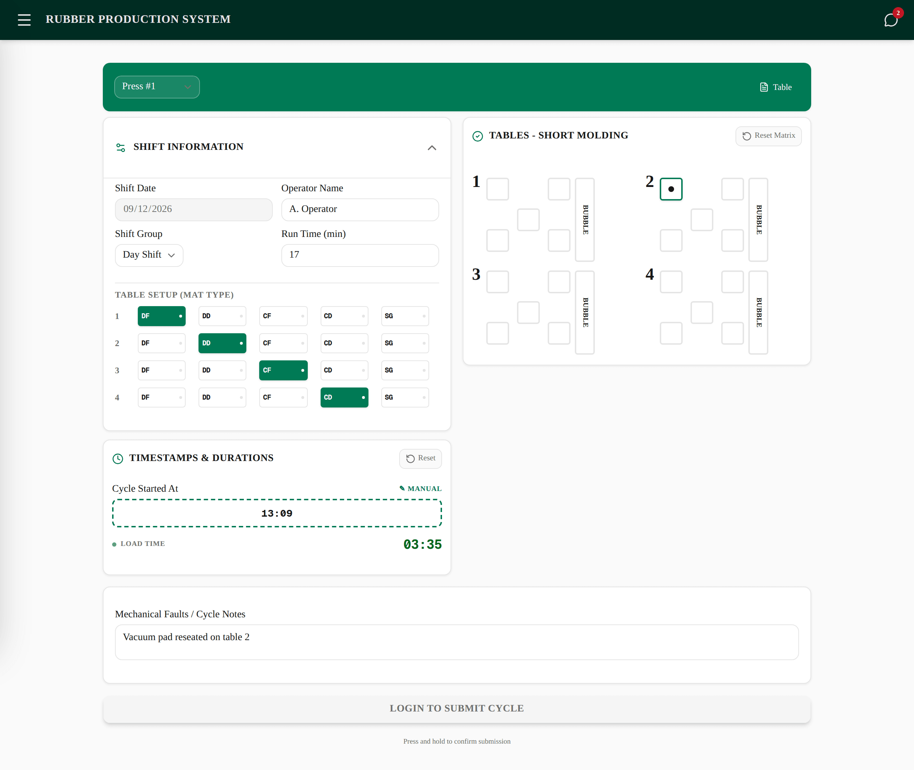
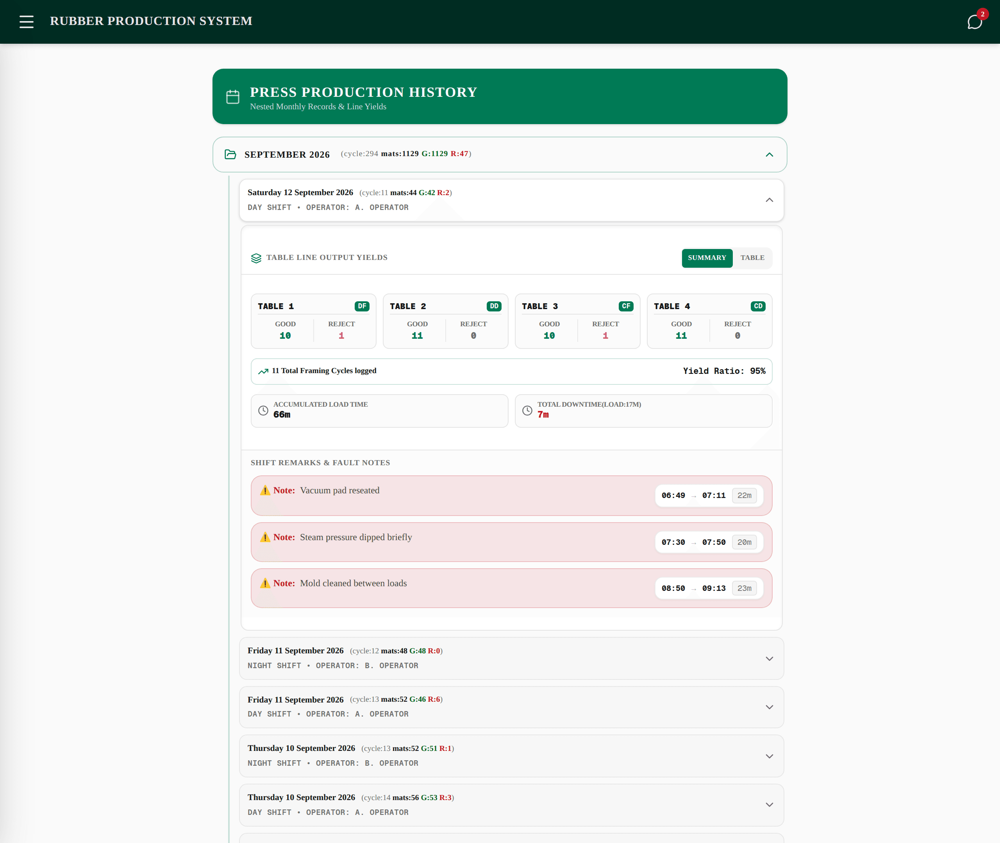
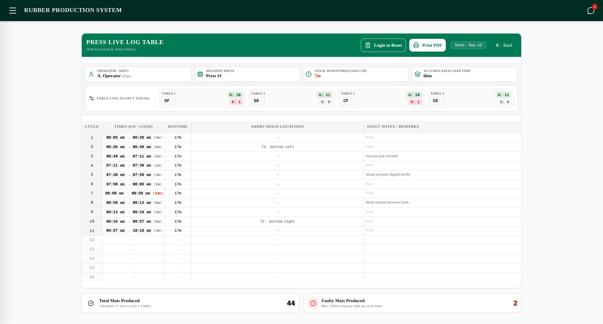
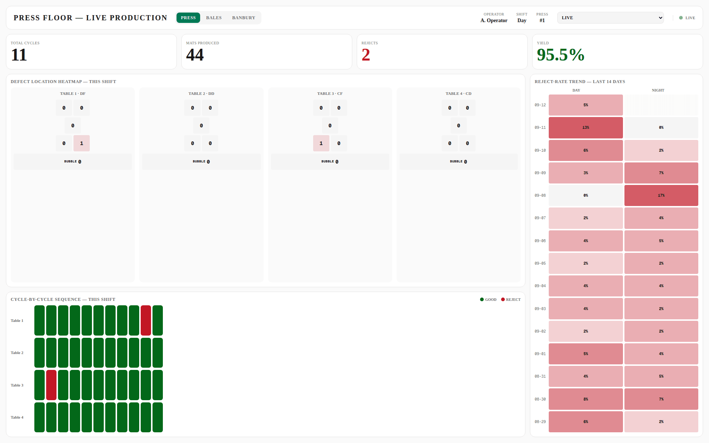

# Rubber Production Tracking System

A single-page operational tool for rubber manufacturing shift logging, covering **three production lines** — **Press**, **Banbury** and **Bales**. Operators log their line's cycles in real time from a mobile-optimised terminal; a live audit table, a printable single-page sheet, a browsable production history and a control-room wallboard let anyone — including a remote viewer who never logs in — see shift performance as it happens.

[](https://nextjs.org)
[](https://react.dev)
[](https://www.typescriptlang.org)
[](https://tailwindcss.com)
[](https://supabase.com)
[](https://nextjs.org/docs/app/guides/static-exports)

**Live:** <https://waai.au/rubbergem> — the control-room wallboard is the `/tv` route of the same deployment.

---

## Screenshots

<table>
  <tr>
    <td width="50%" valign="top">
      
      <p align="center"><b>Entry terminal</b> — shift setup, tap-to-start cycle timing, and the short-mold / bubble defect grid.</p>
    </td>
    <td width="50%" valign="top">
      
      <p align="center"><b>Production history</b> — archived shifts by month and day, per-table yields, downtime and fault notes.</p>
    </td>
  </tr>
  <tr>
    <td colspan="2">
      
      <p align="center"><b>Live audit table</b> — realtime shift header, the fixed 16-row grid that prints to one landscape page, and the shift's downtime and yield totals.</p>
    </td>
  </tr>
  <tr>
    <td colspan="2">
      
      <p align="center"><b><code>/tv</code> wallboard</b> — read-only control-room view: KPI row, defect-location heatmap, cycle-by-cycle strip and the 14-day reject-rate trend.</p>
    </td>
  </tr>
</table>

> Screenshots are captured from a local production build against seeded demo data, so no real shift's numbers or operator names are published.

---

## Contents

- [Quick start](#quick-start)
- [Technical stack](#technical-stack)
- [The three production lines](#the-three-production-lines)
- [Main application features](#main-application-features)
- [Theme system](#theme-system)
- [Database setup](#database-setup)
- [Conventions and gotchas](#conventions-and-gotchas)
- [Project structure](#project-structure)
- [Deployment](#deployment)

---

## Quick start

**Requirements:** Node.js **20.9+** (required by Next.js 16) and a Supabase project.

```bash
# 1. Install dependencies
npm install

# 2. Point the app at your Supabase project
cat > .env.local <<'EOF'
NEXT_PUBLIC_SUPABASE_URL=https://<your-project>.supabase.co
NEXT_PUBLIC_SUPABASE_ANON_KEY=<your-anon-key>
EOF

# 3. Apply the schema — see "Database setup" below

# 4. Run it
npm run dev          # http://localhost:3000
```

`.env.local` is git-ignored; never commit it. The anon key is a public client key guarded by Row Level Security, so **the RLS policies in the SQL files are the actual access control** — apply them all.

| Command | What it does |
|---|---|
| `npm install` | Install dependencies |
| `npm run dev` | Next.js dev server on <http://localhost:3000> |
| `npm run build` | Production build — a **static export** to `out/` (`next.config.ts`: `output: "export"`) |
| `npm run start` | Serve the production build |
| `npm run lint` | ESLint (`eslint-config-next` core-web-vitals + typescript) |

There is no test suite configured in this repo.

---

## Technical stack

- **Framework:** Next.js 16 (App Router), deployed as a **static export** served from `https://waai.au/rubber`
- **Library:** React 19 (hooks, `localStorage`-backed state)
- **Database & realtime:** Supabase (Postgres + Row Level Security + Realtime subscriptions)
- **Styling:** Tailwind CSS v4, semantic CSS custom-property design tokens (`--background`, `--primary`, `--card`, `--border`, `--radius-card`, `--shadow-card`, …) driving a 9-theme system, plus a custom `@media print` stylesheet for the audit sheets
- **UI components:** shadcn/ui (`radix-nova` style) primitives — Card, Button, Input, Select, Checkbox, RadioGroup
- **Icons:** Lucide React

> **Note for contributors (and AI assistants):** this Next.js version has breaking changes versus most training data. Read the relevant guide in `node_modules/next/dist/docs/` before writing Next.js-specific code (routing, config, data fetching), and heed any deprecation notices there. See `AGENTS.md`.

---

## The three production lines

Each line is a self-contained module: its own entry form, live audit table and history view, its own Supabase tables, its own reset RPC, and its own login account (`lib/line-accounts.ts`). A line's form only writes when *that* line's account is signed in, and signing in reorders the burger menu so your line's screens come first.

| | **Press** | **Banbury** | **Bales** |
|---|---|---|---|
| **Account** | `press@rubbergem.com` | `banbury@rubbergem.com` | `bales@rubbergem.com` |
| **Entry form** | `components/PressForm.tsx` | `components/BanburyForm.tsx` | `components/BalesForm.tsx` |
| **Live table** | `app/ProductionTable.tsx` | `app/BanburyTable.tsx` | `app/BalesProductionTable.tsx` |
| **History** | `components/ProductionHistory.tsx` | `components/BanburyHistory.tsx` | `components/BalesHistory.tsx` |
| **Shared helpers** | `lib/shift-log.ts` | `lib/banbury-log.ts` | `lib/bales-log.ts` |
| **Live rows** | `live_log` | `banbury_live_log` | `bales_live_log` |
| **Archive** | `production_logs` | `banbury_production_logs` | `bales_production_logs` |
| **Shift setup** | `shift_config` | `banbury_shift_config` | `bales_shift_config` |
| **Reset RPC** | `reset_shift_log` | `reset_banbury_shift_log` | `reset_bales_shift_log` |
| **An "entry" is** | one press cycle | one chemical/tank check | one bag-run |
| **Grid height** | 16 rows | 32 rows | 22 rows |
| **Downtime rule** | past a **17 min** load target | past a **16 min** check cycle | — (Total Run Time instead) |

All three archives hold **exactly one row per `(date, shift group)`**, written live as the shift runs. Identity is resolved from the database on every write (`localStorage` is only a per-browser fast path, never the identity), backed by a unique index — created directly for Banbury/Bales, and via the optional cleanup pass in `production_logs_dedupe.sql` for Press, whose table predates the rule. A losing insert returns SQLSTATE `23505` and is handled by re-resolving and updating. Cycles are **merged rather than replaced** on each write, so a mid-shift reset or a second terminal joining an open shift never splits or loses a shift's data.

### 1. Press (`PressForm` · `ProductionTable` · `ProductionHistory`)

- **Press switcher:** toggles the active config between **Press #1** and **Press #2**.
- **Four tables per cycle,** each with its own mat type (`DF`, `DD`, `CF`, `CD`, `SG`).
- **Defect capture:** an absolute-coordinate grid for marking short-mold position per table, plus a Left/Middle/Right bubble-defect checkbox matrix with size selection.
- **One-reject-per-table-per-cycle rule:** a table counts as a reject if *either* a short-mold position or a bubble checkbox is set, never more than once per cycle.
- **Runtime column:** records the target run time (minutes) active *when each cycle was submitted*, persisted per-row so later changes to the target don't rewrite earlier rows.
- **Total Downtime (17m):** load time is the cycle's elapsed time minus the press's configured run time; the shift total sums every minute past the 17-minute target (clamped at 0 per cycle), shown in red.

### 2. Banbury (`BanburyForm` · `BanburyTable` · `BanburyHistory`)

- **Chemical/tank checklist:** six material ticks (Crumb Rubber, Other Rubbers, Powdered Chemicals, RPO, Sulphur, Liquid Chemicals) as **press-to-confirm** buttons — every check starts grey and a press marks it done, matching what the operator reaches for at the machine. (This is inverted from the original build; `banbury_live_log_flip_tick_defaults.sql` flipped the column defaults to `false` so an absent tick reads as "not done", never as "assumed done".) Logging a check is deliberately *not* gated on all six being green.
- **Tank levels:** right/left, stored as `TEXT` because the paper cell holds either a number (`302`) or the word `Full`.
- **Check cycles:** tap to open, log to close — the row spans `start_time` → `check_time` with `run_time_minutes` between them, and logging immediately opens the next cycle, so the interval doubles as "time since the last check".
- **Total Downtime (16m):** every minute a check cycle runs past the standard 16-minute cycle, summed for the shift. Defined once in `lib/banbury-log.ts` (`BANBURY_DEFAULT_RUN_TIME_MINUTES`, `checkDowntimeMinutes`, `isCheckOverrun`, `totalDowntimeMinutes`) and consumed by the form, table and history so the three can't drift.
- **Shift-wide output totals:** unlike Press/Bales, a Banbury entry carries no output. Product, bag weight, batches made and 30-mesh bag count live on `banbury_shift_config`, and Tonnes (`bags × bag weight ÷ 1000`) and Average Output P/H (`tonnes ÷ run time`) are computed client-side from the sheet's own formulas and snapshotted into the archive.

### 3. Bales (`BalesForm` · `BalesProductionTable` · `BalesHistory`)

- **Per-cycle counts:** bales produced, bale type, faulty bales count and notes — no four-table or good/reject split, so the rollups are straight sums (`balesTotalsFromCycles`).
- **Computed end time:** `end_time` isn't operator-entered; it's `start_time + run_time_minutes`, stored so the table doesn't have to re-derive it.
- **Mesh type snapshotted per row,** so changing the shift-wide mesh type never retroactively alters historic rows.
- **Bag changes:** a separate append-only `bales_bag_changes` log (East/West side, weight in kg, auto-numbered per side) written from its own dialog and shown as a mini-log on the table — an immutable event record, with no UPDATE policy.
- **Shift-level `main_issues_faults`** free-text summary alongside the per-cycle notes.

---

## Main application features

`app/page.tsx` is a client-side view switcher (**not** the Next.js router) that swaps between **ten views** by local state — an entry form, live table and history for each of the three lines, plus the About page. `/tv` is the only other route. `page.tsx` also owns login/session state, the burger-menu nav (grouped per line, reordered so the signed-in line comes first), a global per-cycle countdown timer, and the shift chat panel — all passed down as props.

### Entry terminals

- **Collapsible shift panel** per line, with an inline summary shown even when collapsed.
- **Smart timestamps:** tap-to-start / tap-to-log cycle timing with automatic duration parsing, including midnight-crossover handling (23:55 → 00:20 correctly computes as 25 minutes). Logging an entry stamps its end and immediately opens the next cycle.
- **Debounced shared broadcast:** shift setup is mirrored to that line's `*_shift_config` row while logged in, so a remote viewer sees the live setup without needing to log in. `localStorage` stays the per-terminal source of truth; the config row is the shared broadcast.
- **Live archiving:** every submit both inserts a live row and re-aggregates the shift into its single archive row, so History reflects the shift as it happens rather than only after a reset.
- **Stale-data guard:** if the live log still holds rows but no archive row exists for today's date + shift group, the form offers to clear them before continuing — rather than silently merging two shifts.
- **Duplicate-submit guard:** the submit button disables itself while a submission is in flight, and confirms on press-and-hold.

### Live audit tables

- **Shift header strip:** operator, setup and running totals shown once per sheet, live-subscribed to that line's config and live-log tables via Supabase Realtime — no refresh needed.
- **Fixed-height grid:** always renders the same number of rows (real entries + filler) so every printed sheet has the same shape.
- **Landscape print/PDF:** an embedded `@media print` stylesheet force-fits the full sheet onto a single landscape page. Check layout changes in both screen and print rendering.
- **Reset Shift Log:** login-gated, destructive action that clears that line's live rows via its own `SECURITY DEFINER` RPC — the shift's data is already archived by this point. The reset verifies the delete actually happened before reporting success.

### Production history

- Reads each line's archive, grouped by month and day. Press and Banbury shifts toggle between a totals summary and the full entry-by-entry table; Bales shows the shift totals.
- Day and Night shifts on the same date expand/collapse independently.
- Duplicate rows from before the one-row-per-shift write path was fixed are collapsed on read (most entries wins, highest `id` breaking a tie), so they never render twice or double-count a month.
- Shows a clear error banner (instead of a silent empty list) if the fetch fails.

### Wallboard (`/tv`)

The one extra route in the app: a read-only control-room dashboard covering all three lines. A header switcher picks the line (remembered per screen and synced across tabs) and each line gets its own KPI row, main visual and 14-day trend heatmap:

| Line | Main visuals |
|---|---|
| **Press** | Defect-location heatmap + per-table cycle strip |
| **Bales** | Bales-per-cycle chart + live bag-change log |
| **Banbury** | Material-check matrix, check cycle times, tank levels |

Every line's header can also replay any archived shift from that line's history through the same widgets.

### Shift chat (`components/ChatPanel.tsx`)

- A two-way chat between anonymous viewers and the logged-in operator, rendered in the global header so it's reachable from every view.
- The one place RLS grants **both SELECT and INSERT to `anon`** — by design, since the point is letting an unauthenticated visitor message the operator. Messages are cleared by the same `reset_shift_log` RPC, so chat history is shift-scoped like everything else.

### About page (`app/AboutPage.tsx`)

In-app, plain-language explanation of the three lines and the behaviour they share, aimed at non-technical readers (operators, management) — kept in sync with this README.

---

## Theme system

- **9 selectable themes** (`components/theme/theme-config.ts`): Classic, Editorial Minimal, Dark Glass, Organic Wellness, Cobalt Brutalist, Soft 3D, Retro Future, Neutral Elegance and Tropical Jade Sunrise — each a `[data-theme="…"]` block in `app/globals.css` defining the same set of semantic tokens.
- **One component system, not nine copies:** every page and shared component (including the `Card` family in `components/ui/card.tsx`, token-driven instead of hardcoded `rounded-xl`/`ring-1` values) consumes these semantic tokens, so a theme swap re-skins the whole app without per-component branching. **Never hard-code a theme colour in a component.**
- **`ThemeProvider`** (`components/theme/ThemeProvider.tsx`): sets `data-theme` on `<html>`, persists the choice to `localStorage` (`app-theme`), and syncs the `<meta name="theme-color">` tag for mobile browser chrome.
- **FOUC-free load:** `app/layout.tsx` inlines a small blocking script (`buildThemeInitScript`) that applies the stored theme — or the system's light/dark preference on first visit — before the page paints. The user's explicit pick always wins after that; it is never overwritten by a later system-preference change.
- **`ThemeSwitcher`** (`components/theme/ThemeSwitcher.tsx`): a WAI-ARIA radio group in the burger menu with live colour-swatch previews per theme, full arrow-key/Home/End keyboard navigation and visible focus states, working on mobile and desktop alike.

---

## Database setup

This project does **not** use a migration tool — the schema, RLS policies and RPC functions are applied by hand in the Supabase SQL editor. Run these files (in the repo root) against your project, per line:

**Press**

| File | What it creates |
|---|---|
| `shift_config.sql` | `shift_config` table + RLS policies |
| `production_logs_rls.sql` | RLS policies for `production_logs` |
| `production_logs_dedupe.sql` | Optional cleanup pass, then the one-row-per-shift-day unique index |
| `live_log_add_run_time.sql` | Adds `run_time_minutes` to `live_log` |
| `reset_shift_log.txt` | The `reset_shift_log(p_shift_id text)` RPC — a pure delete of `live_log` + `shift_messages` |
| `shift_messages.sql` | The chat table; the one place `anon` may INSERT |

**Banbury**

| File | What it creates |
|---|---|
| `banbury_live_log.sql` | Live checklist rows |
| `banbury_live_log_add_start_time.sql` | Adds `start_time` / `run_time_minutes` to tables created earlier |
| `banbury_live_log_flip_tick_defaults.sql` | Flips the six material-tick column defaults to `false` (press-to-confirm) |
| `banbury_shift_config.sql` | Current shift setup + shift-wide output totals |
| `banbury_production_logs.sql` | Archive + unique index |
| `reset_banbury_shift_log.txt` | The reset RPC |

**Bales**

| File | What it creates |
|---|---|
| `bales_live_log.sql` | Live cycle rows |
| `bales_shift_config.sql` | Current shift setup |
| `bales_production_logs.sql` | Archive + unique index |
| `bales_bag_changes.sql` | Append-only bag-change log |
| `reset_bales_shift_log.txt` | The reset RPC |

The `live_log` and `production_logs` tables themselves are expected to already exist — see `components/PressForm.tsx`'s payload objects for the columns each one writes.

**Accounts.** Create the three operator logins (`press@`, `banbury@`, `bales@rubbergem.com`) as email/password users in Supabase Auth; `lib/line-accounts.ts` maps each address to the line whose writes it unlocks.

**Realtime.** Each table read live by a table view or the wallboard must be in the `supabase_realtime` publication — the `ALTER PUBLICATION` lines at the end of the SQL files do this.

---

## Conventions and gotchas

Read these before changing behaviour; each has bitten this codebase before.

**Perth time is the shop clock.** The site runs on `Australia/Perth`, but timestamps are stored and compared several ways (`Intl.DateTimeFormat` with `timeZone: "Australia/Perth"`, manual `+08:00` offset construction in the forms, UTC conversions in SQL). When touching date/time logic, check the form's timestamp construction and its `currentDate` (Perth `YYYY-MM-DD`, used as `production_logs.date`) *together* — this has been a recurring source of off-by-one-day bugs.

**The reject rule lives in three places.** "Max 1 reject per table per cycle" is computed independently in `PressForm`'s submit handler (which bakes `good`/`reject` into each cycle's `short_mold_json`), in `tableYieldsFromCycles` (`lib/shift-log.ts`, which sums those across the shift's merged cycles) and in `ProductionTable`'s footer stats. Change one, change all three.

**Shift identity comes from the database, not `localStorage`.** The archive tables carry no `shift_group` column — the shift is embedded in the free-text `operator_shift` as `` `${operator} (${shift})` `` and derived with `shiftGroupOf`. `localStorage["production_log_id"]` is a per-browser fast path only. Treating it as the identity is what caused the original duplicate-row bug.

**State persistence pattern.** The forms mirror nearly all state to `localStorage`, poll it every second, and listen for the `storage` event so multiple tabs on one terminal stay in sync. When adding a form field, follow the existing shape: a `useState` initialiser that reads `localStorage`, a dedicated `useEffect` that writes on change, and an update to the polling `handleStorageChange`.

**Print layout is part of the deliverable.** The audit tables embed a `@media print` stylesheet (`<style jsx global>`) to force their grid onto a single landscape page (`@page { size: landscape; margin: 0.2cm 0.3cm; }`, `.no-print` for UI chrome, `.print-compact` for tightened padding). Check any table layout change in both screen and print (`window.print()`) rendering.

**`components/ui/*` are vendored shadcn primitives.** Treat them as generated building blocks: prefer adding new components via the shadcn CLI over editing primitives directly, unless you're fixing a real bug in one.

**Reset is destructive.** Each `reset_*_shift_log` RPC is a pure `DELETE` of that line's live rows (plus `shift_messages` for Press); it no longer aggregates or archives, because the archive already exists by shift end. The action is login-gated — treat that path carefully.

---

## Project structure

```text
rubbergem/
├── app/
│   ├── page.tsx                    # View switcher shell, auth/session, per-line nav, global cycle timer
│   ├── ProductionTable.tsx         # Press live audit table, print/PDF layout, Reset Shift Log
│   ├── BanburyTable.tsx            # Banbury live check log, downtime totals, print/PDF layout
│   ├── BalesProductionTable.tsx    # Bales live cycle table + bag-change mini-log
│   ├── AboutPage.tsx               # In-app plain-language overview of the three lines
│   ├── tv/page.tsx                 # Wallboard shell (/tv) — picks the line, remembers the choice
│   ├── layout.tsx                  # Root layout, viewport config, blocking theme-init script
│   ├── globals.css                 # Base styling layer + one [data-theme="…"] token block per theme
│   ├── manifest.ts                 # PWA manifest
│   └── icon.tsx, apple-icon.tsx    # Generated app icons
├── components/
│   ├── PressForm.tsx               # Press entry terminal   → live_log / production_logs
│   ├── BanburyForm.tsx             # Banbury entry terminal → banbury_live_log / banbury_production_logs
│   ├── BalesForm.tsx               # Bales entry terminal   → bales_live_log / bales_production_logs
│   ├── ProductionHistory.tsx       # Press archived-shift browser
│   ├── BanburyHistory.tsx          # Banbury archived-shift browser
│   ├── BalesHistory.tsx            # Bales archived-shift browser
│   ├── ChatPanel.tsx               # Shift-scoped two-way chat (shift_messages)
│   ├── tv/                         # Wallboard: one panel per line + shared header, KPI row,
│   │                               #   sequence grids, defect and trend heatmaps, data hooks
│   ├── theme/
│   │   ├── theme-config.ts         # Theme IDs/labels, storage key, FOUC-prevention init script
│   │   ├── ThemeProvider.tsx       # data-theme + localStorage + meta theme-color sync
│   │   └── ThemeSwitcher.tsx       # Keyboard-accessible theme picker (burger menu)
│   └── ui/                         # shadcn/ui primitives — token-driven, theme-agnostic
├── lib/
│   ├── supabase.ts                 # Supabase client (anon key)
│   ├── line-accounts.ts            # The three per-line login accounts + active-line lookup
│   ├── shift-log.ts                # Press shift identity, cycle merge, table yields, error helpers
│   ├── banbury-log.ts              # Banbury check merge + downtime helpers (16-minute cycle)
│   ├── banbury-check-timing.ts     # Degraded-mode shim for banbury_live_log's timing columns
│   ├── bales-log.ts                # Bales cycle merge + shift totals
│   ├── heatmap-color.ts            # Wallboard heatmap colour scale
│   └── utils.ts                    # cn() class merge helper
├── docs/screenshots/               # README screenshots
├── shift_config.sql                # ─┐
├── production_logs_rls.sql         #  │
├── production_logs_dedupe.sql      #  │
├── live_log_add_run_time.sql       #  ├─ Manual SQL, applied in the Supabase SQL editor
├── shift_messages.sql              #  │  (see "Database setup" above)
├── banbury_*.sql                   #  │
├── bales_*.sql                     #  │
├── reset_*.txt                     # ─┘  SECURITY DEFINER reset RPCs, one per line
├── migrate.js                      # One-off legacy backfill script — reference only, not runnable
├── next.config.ts                  # output: "export", images unoptimized, no basePath
├── package.json
└── README.md
```

---

## Deployment

`npm run build` emits a fully static site to `out/` — no Node server, no image optimiser, no `basePath`. Copy `out/` to whatever serves `https://waai.au/rubber`.

Because the build is static, **`NEXT_PUBLIC_*` values are baked into the bundle at build time**: change the Supabase project and you must rebuild, not just restart. Both variables are public by design — the anon key is meant to ship to the browser, and Row Level Security is what keeps the data safe.
